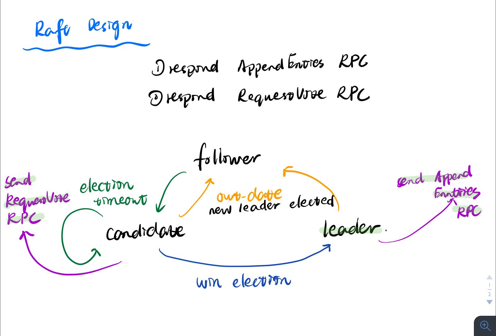

# MIT6.824 - Raft

## Paper: In Search of an Understandable Consensus Algorithm \(Extended Version\) \(2014\) 

[http://nil.csail.mit.edu/6.824/2020/papers/raft-extended.pdf](http://nil.csail.mit.edu/6.824/2020/papers/raft-extended.pdf)

## Introduction

Raft是用于管理复制日志的一致性算法，但由于与paxos结构不同，raft更加容易被理解。

共识算法\(consensus algorithm\) 可以使得一组机器作为一个工作组，在某些成员故障时仍然能很好地运行。

raft算法有几点创新点：

* Strong leader：例如所有日志都只能从该leader流向其它服务器；
* Leader election：Raft使用随机的定时器来选举leader；
* Membership changes：raft更改集群中服务器集的机制，使用了一种新的共识算法，两种不同配置的机器允许在转换期间重叠；

## Replicated State Machine

共识算法通常出现在复制状态机的上下文中，通过复制日志实现，如下图，每个服务器都存储着一些列命令的日志，状态机按顺序执行，由于状态机时确定性的，因此每个都计算出相同的状态和输出序列。

1. Client向Server发出请求
2. Server将其持久化到Log中，并使其他的Server都有这个Log
3. Server将Log作为输入，输入到State Machine中
4. 将State Machine的结果返回给Client

同样用了Replicated State Machine，Raft与上一篇文章VMware-FT系统里不同的是

1. Raft中输入和输出只是KV系统的input\(get, put\)，而VMware将机器的所有input和部分indeterministic instruction都要作为input
2. 在第2步使其他的Server都有这个Log，都用的是leader来同步到server。但两者的选举方式和同步条件都不一样。

## The Raft Consensus Algorithm

下图从程序设计的角度上总结了raft算法：

raft通过选举一个leader来实现共识，然后让该leader负责管理复制的日志。leader可能会与服务器断开连接，这时需要选出新的leader。

### Raft Basic

#### Spacial Basic

raft集群中包含多个服务器，在任意时间内，每个服务器都处于以下三种状态之一：leader、follower、candidate。一般情况下，只有一个leader，其它都是follower。follower不会自发请求，而是响应leader和candidate的请求，leader处理所有来自client的请求（即便client私自联系了follower，也会被重定向到leader）。以下是状态转换图：

#### Temporal Basic

raft将时间划分为任意长度，如下图：

term是一个逻辑时钟，采用连续的整数编号。每个term都以选举开始，如果有candidate成为了leader，那么它将成为在剩下的term时间内成为leader。raft保障在一个term内最多只有一个leader。

不同的服务器可以在不同的时间观察term之间的转换，每个服务器都有一个当前的term编号，并且随着时间单调递增。服务器间通信时交换当前term。如果一个服务器的当前term小于另一个服务器的当前term，则它将其当前term更新为更大的值。 如果候选人或领导者发现其term已过期，则会立即变成到follower的状态。 如果服务器收到带有过期term的请求，它将拒绝该请求。

#### Logical Basic

假设有一个系统里面有2x+1个节点，对于某个操作，当x+1个节点都更新了之后，就可以认为这个操作被整个Raft系统所认可，基于以下两条规则：

1. leader选举需要大部分的节点同意（前提是确认leader手中的信息起码比自己新），然后就跟随这个leader
2. 单个input的commit需要大部分节点都有这条log

由这两条规则构建出来的系统，选出的leader拥有最新的信息（否则不能得到大部分人的同意，原因是一个信息的commit需要大部分人同意），而且能够不断地将新的信息push到系统中（follwer会跟随leader）

### Leader Election

对于系统里的leader，需要满足以下条件：

1. leader在系统刚开始的时候会被选出来
2. 当这个leader故障了应该有一个新的leader被选出来
3. 最多只能有一个有效leader
4. 不要让系统陷入僵局

对于2，可以想到用计时的方式选leader。当一个follower很久都没有收到leader的信息了，说明leader已经故障，自己将变成candidate来竞选leader。这个方式也能解决1，在刚开始的时候所有peer的初始状态都是follower，默认会超时，然后节点会开始竞选，最终会有一个leader产生。

对于3，在同一个term中，一个节点成为leader需要得到大部分节点的同意，所以一个term不会有两个以上的leader。但在不同的term中，考虑这种情况：

一个正常工作的网络被分成了两部分，leader和小部分节点为一part，剩下大部分节点为一part。在有leader的那一part，leader继续向其他节点发心跳，但由于节点数量无法达到大部分，所以这个小网络内再也不能有新的commit了。在没有leader的那一part，会因为接不到leader的心跳发生选举，最终产生一个新leader，并且可以有新的commit。然后，这个网络恢复了～

在这种情况下，就有了一个过期的leader和一个现任leader。然而在Raft中，只有现任leader是有效的。对于过期的leader和跟随它的那些节点，收到了新leader的AppendEntry后发现term比自己大，就会将自己变成follower。对于新的follower，收到了过期leader的AppendEntry，比较发现term比自己的小，直接丢掉并返回自己的term告诉它你过期了。

对于4，确实有可能系统陷入僵局，一直没有leader产生。这个时候Raft用了一个很聪明的方式，让每个节点的Expire Time随机在一个范围内产生，这样就一定会有一个偏小的节点能抢到leader。

### Log Replication

在leader选举完毕之后，就开始为client请求提供服务，client把这些命令提供给状态机，leader则把命令作为新的条目添加到日志中，并通过**AppendEntries RPC**并行地发送到每个其它的服务器以复制条目。如果发送失败/包丢失/follower崩溃，leader会无限重试。  
日志的组织结构如下，每个条目都有一个term编号：

Raft保证提交的条目是持久的，并最终由所有可用的状态机执行。一旦创建条目的领导者将其复制到大多数服务器上（例如，上图中的条目7），就会提交日志条目。并且还会提交leader日志中的所有前面的日志。

Log Matching属性：

* 如果不同日志中的两个条目具有相同的index和term，则它们存储相同的命令。
* 如果不同日志中的两个条目具有相同的index和term，则所有前面的条目中的日志相同。

第一个属性是基于leader在给定的term中最多创建一个具有给定日志索引的条目，并永远不会更改其在日志中的位置；第二个属性由AppendEntries执行的简单一致性检查保证。发送AppendEntries RPC时，leader在其日志中加入紧接在新条目之前的条目的索引和term。如果follower找不到相同索引和term的条目，则拒绝新日志条目。

正常情况下，leader和follower保持着一致的日志，但也有可能出现日志不一致的情况，比如旧leader可能不提交日志，如下：

为了解决这种情况。raft会让leader通过强制follower的日志复制自己的日志来覆盖处理。

要使得follower的日志与leader保持一致，leader必须找到共同的最新日志条目，在该店之后删除follower日志中的所有条目，然后往follower发送这之后的所有在leader上存在的日志。所有这些操作都是在响应AppendEntries RPC执行的一致性检查时发生的。leader为每个follower维护一个nextIndex，这是leader将发送给follower的下一个日志条目的索引。leader选举出来后，所有的nextIndex会被初始化到其日志中最后一个之后的索引（上图中的11）。如果不一致，RPC将会失败，拒绝后，leader会减少nextIndex，知道RPC成功。

> 当然也可以做优化，减少AppendEntries RPC，则follower可以发送冲突条目的term和它为该term存储的第一个索引。这样就是一个term一次RPC。

该机制使得leader在选举出来后，无需采取额外的操作恢复日志，而是正常运行，并且由于RPC自动收敛日志。Leader Append-Only，leader永远不会覆盖或者删除自己的日志。

### Safe

当leader提交多个日志时，follower可能崩溃了，这时新的leader会用新的日志条目覆盖原来的那些日志，导致不同的状态机可能执行不同的命令序列。

**Election restriction**

在基于leader的一致性算法中，leader最终会存储所有提交的日志条目，raft通过保证先前term的所有已提交的日志条目从其选举时出现在每个新leader身上，这意味着日志只会从了leader流向follower，leader之间不会覆盖日志。

如果candidate的日志中没有与大多机器的日志保持着最新，raft会使用投票来阻止candidate赢得选举。RequestVote RPC实现了这一限制：RPC包含有关候选人日志的信息，如果其自己的日志比候选者的日志更新，则选民拒绝其投票。

通过比较日志中最后一个条目的term和index，Raft确定两个日志中哪一个更新。如果日志包含具有不同term的最后一个条目，则具有较晚term的日志为新的。如果日志以相同的term结束，则index更大的日志是新的。

**Committing entries from previous terms**

一个leader不能立马对之前term的log entry是否复制到大多数server来判断其是否已被提交。下图就是这样一个例子：

在c中，term2的日志已经在大多数server中了，但如果此时leader S1 crash的话，在d这种情况下，term2的日志会被新leader S5给重写。

为了消除这种情况，raft不会通过副本数来commit之前的log entries。只有当前term的log entries才会通过计算副本数被commit。

## Log compaction

日志会在服务器运行期间无限增长，如果我们不及时丢弃过期的日志，那么对着日志的增长，它会占据更多的内存空间并需要更多时间来重新执行日志。

snapshot是最简单的压缩方法，下图就是raft的快照方式：

每个服务器独立获取快照，快照内容仅仅覆盖了已提交的条目。快照除了包括状态集信息之外，还包含了少量的元数据信息，如上图就包含了最近索引和term。包含了这些信息，可以帮助支持快照后第一个日志条目的AppendEntries一致性检查。

虽然服务器独立生成快照，但一般情况下，如果有一个落后非常多的follower或者新的服务器加入集群，leader会通过InstallSnapshot RPC往其它服务器发送快照。

如果snapshot中包含了follower未包含的日志新内容，该follower会丢弃整个日志，并用snapshot替代。如果接收者收到的snapshot是当前日志的前缀部分，则该快照后面的条目保留，其余删除。

如果是由leader生成snapshot再转发到各个follower，这种做法会浪费网络带宽并降低生成快照的速度。另外还有两个问题会影响性能：

* 服务器必须决定何时进行快照。一个简单的策略是在日志达到固定大小（以字节为单位）时拍摄快照，此大小设置为远大于快照的预期大小，则用于快照的磁盘带宽开销将很小
* 写快照可能需要很长时间，我们不希望这会延迟正常操作。解决方案是写时拷贝

## Client interaction

本节主要描述raft客户端与raft的交互。

raft将所有的客户端请求发送到leader，如果客户端联系的不是leader，那么服务器会拒绝这一请求，并提供最新的leader地址。

我们对Raft的目标是实现可线性化的语义（即每个操作似乎在其调用和响应之间的某个时刻只执行一次）。但如果leader在提交日志条目之后但在响应客户端之前发生了冲突，则客户端将使用新的leader重试该命令，从而变成了二次执行。解决方案是客户端为每个命令分配唯一的序列号，如果它收到一个序列号已经执行的命令，它会立即响应而不重新执行请求。

只读操作可能会因为leader的重新选举而返回过时的数据，raft需要在不使用日志的情况下确保自己不返回过期的数据，这里采取两个措施：

* 首先，leader必须拥有关于提交的日志的最新信息。虽然leader拥有所有提交了的日志，但leader不知道这是什么，Raft通过让每个leader在其任期开始时将空白的无操作日志条目输入到日志中来处理此问题。
* 其次，leader必须在处理只读请求之前检查它是否已被废除；这个可以通过与大多数集群交换心跳来解决；

## Lab2: A fault-tolerant key/value storage system using Raft

这里记录一些做lab的时候被卡住的地方：

### 2A: Leader Election

1.在peer结束的时候没有kill线程，留到了下一个test

2.边缘情况没有考虑

* 脑裂的leader收到了新leader的心跳应该把自己变成follower
* 等待过程中自己的状态发生了变化（如原本是candidate，因为来了个新term的leader变成了folower）这时候应该取消自己的状态）

3.维护状态 实现的时候忘记在变成leader的时候恢复voteFor

4.避免非功能性的死循环（功能性的比如，一个节点一直计时等待Expire Time是功能性一定要求要做的。其他的死循环不要写）

### 2B: Log Replication

1. 在实现的时候ch -&lt; 返回的是这条指令（刚开始不懂这个）
2. 一些边缘情况

* 在被请求投票时，对于更新term的投票，也作为votefor的一个可接受条件，确认log至少更新后就可以投
* 对于满足term更新但log的条件不满足时，不投票，但更新自己的term
* 延迟调用后立马检查线程是否需要被kill（role，bekilled等条件）

### 2C: Persistent

简直打开了新世界的大门，简单地实现了persist之后跑test，测出了很多来自2A和2B的bug。写2A的时候没有经过设计就上手，导致整个框架实现的非常乱，只能重构。

1. 整理了三种状态转移的事件，如图。构建了一个StateMachine来做状态转移。
2. 整理了线程模型，主要分为以下几个

* ElectionTimeOut，定时检查心跳时间，尝试转为candidate
* SendHeartBeat，leader定时发送心跳
* RPC，RequestVoteRPC和AppendEntryRPC都需要单独的线程发起
* ApplyCh（图中无），用来提交commit之后的msg到ApplyCh

其中ElectionTimeOut，SendHeartBeat是由计时器驱动的无限循环，ApplyCh是由事件驱动的（每当commitIndex更新后被唤醒）的无限循环。

需要注意的是要注意是否造成了死循环的情况（for{}）这种。我原本将ElectionTimeOut里的判断是否为Leader的条件写在了计时前，导致占用太多的锁资源。（就说为什么单个test能跑通，几个一起跑就不行。。）

对于RPC，特别的地方在于中间有一段网络调用引起的延时。由于网络调用的时候需要释放锁，所以需要判断RPC前后的状态是否一致（role、currentterm）。特别是在AppendEntryRPC中，若特定server的nextIndex发生了改变，也说明了这个调用过期了，就不再需要处理reply。

由于2C里面有两个网络不稳定的test，加入了丢包、乱序、延时的干扰，对于丢包这种情况，RPC调用里返回ok=false的，我引入了手动retry，重新发一个RPC。

3. 仔细阅读guide

根据[guide](https://thesquareplanet.com/blog/students-guide-to-raft/)，找出了一些bug。

* 在不仅在收到AppendEntry，在给candidate投票的时候也要重制心跳
* 当leader发出AppendEntry被拒绝，但理由又不是因为log不一致时，不需要重发，直接return
* 在AppendEntry成功返回后，更新matchIndex不应该是到log的末尾（因为期间log可能更新过），而应该更新为prevLogIndex + len\(entries\[\]\)

