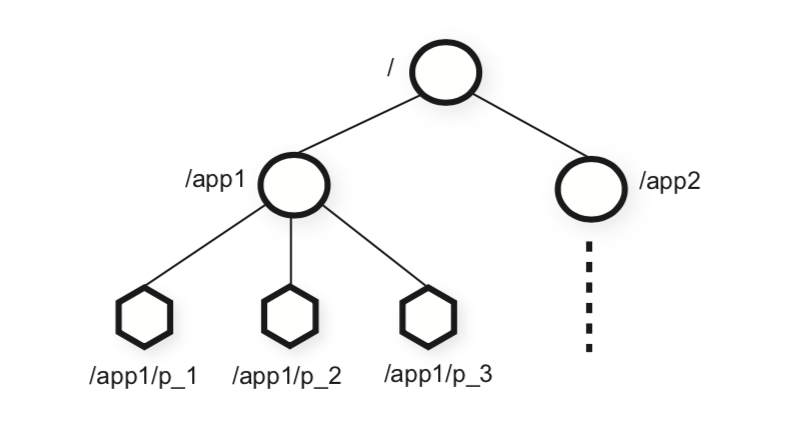

# MIT6.824 - Zookeeper

## Paper: ZooKeeper: Wait-free coordination for Internet-scale systems\(2010\)

[http://nil.csail.mit.edu/6.824/2020/papers/zookeeper.pdf](http://nil.csail.mit.edu/6.824/2020/papers/zookeeper.pdf)

## Introduction

The ZooKeeper interface enables a high-performance service implementation. In addition to the wait-free property, ZooKeeper provides a per client guarantee of FIFO execution of requests and linearizability for all requests that change the ZooKeeper state. These design decisions enable the implementation of a high performance processing pipeline with read requests being satisfied by local servers.

### Raft Review

回顾Raft，Raft确实是一个能够保证linearizability的系统，但当Raft增加了机器的数量时，他的效率得到提高了么？

对于写和读两种操作，都需要系统里大部分的机器得到复制之后才能commit，所以他的时间复杂度是O\(n\)，意味着每增加一个机器就要慢一点。

这样的系统虽然保证了局部容错性（CAP里面的P），但效率缺大打折扣。

那是否能够通过只在一台机器上面读来增加读的效率呢（尝试将读的时间复杂度变成O\(1\)）？但我们发现只在一个副本上读时，会有一些问题：

1. 可能这个副本不在达成共识的大多数上面，导致stale read
2. client commit了一个写操作后，可能读不到自己的结果
3. 这个副本可能已经跟系统剥离了
4. 如果client先看到的是一个新的副本，然后再看到一个旧的副本，会发现自己原本能看到的一些东西后面又看不到了

在这个基础上ZooKeeper希望能够提高效率，提高效率的方式是改变强一致性的定义。

### Zookeeper

在大多数场景下，我们只需要考虑一个客户看到的操作是linearizability就行，对于不同的客户有的看到的相对新，有的看到的相对旧其实没有那么关键。也就是在上面提到的有关Raft粗暴版本的read优化里的几个问题，对于问题1是能够容忍的，主要解决2、3、4。保证单个client读操作的顺序。

## Ordering Guarantees

* Linearizable writes

  clients send writes to the leader

  the leader chooses an order, numbered by "zxid"

  sends to replicas, which all execute in zxid order

  this is just like the labs\(raft\)

* FIFO client order

  each client specifies an order for its operations \(reads AND writes\)

  * writes:

    writes appear in the write order in client-specified order

    this is the business about the "ready" file in 2.3 \(?\)

    client可以一次发很多个来write异步地执行，在client端为这些writes标记好了顺序，server端按照client的顺序来做。并且会向client返回write的zxid，来保证后面的read是在zxid后的。

  * reads:

    each read executes at a particular point in the write order

    a client's successive reads execute at non-decreasing points in the order，即使当client切换replica的时候也不会读到旧的版本。因为client本地会保存当前读到的最新的'zxid'，换replica的时候会将自己读到的zxid号发过去。如果replica没有client当前读到的最新记录，会delay或者直接rej掉这个请求

    a client's read executes after all previous writes by that client，如果一个client先发了一个write再发了一个read同样的路径，为了保证FIFIO，read必须等write执行完再读。

### Why does this make sense?
1. sync() 能够让client同步到最新的log，通过leader进入系统并commit到别的replica，sync后面的读会确保在sync之后；
2. Writes are well-behaved, e.g. exclusive test-and-set operations
    writes really do execute in order, on latest data.
3. Read order rules ensure "read your own writes".
4.  section 2.3讲到的configuration是一个通用的应用场景；
    e.g. if read sees "ready" file, subsequent reads see previous writes.
         (Section 2.3)
         Write order:      Read order:
         delete("ready")
         write f1
         write f2
         create("ready")
                           exists("ready")
                           read f1
                           read f2
         even if client switches servers!
    e.g. watch triggered by a write delivered before reads from subsequent writes.
         Write order:      Read order:
                           exists("ready", watch=true)
                           read f1
         delete("ready")
         write f1
         write f2
                           read f2
   watch=true会让这个文件被删除或者修改时（实际上是replica在log中看到与这些操作有关的entry时会停止执行read，先向client发通知）向client发通知。实际上replica会自己缓存一个watch table缓存所有的watch。
   当client切换副本时，会将之前的watch所执行到的zxid发到新的副本，来保证上下文一致。
   
### Consequeces
  Leader must preserve client write order across leader failure.
  Replicas must enforce "a client's reads never go backwards in zxid order"
    despite replica failure.
  Client must track highest zxid it has read
    to help ensure next read doesn't go backwards
    even if sent to a different replica
    
## The ZooKeeper service
ZooKeeper客户端库通过客户端API向ZooKeeper提交请求，在本节中，我们首先提供ZooKeeper服务的高级视图。 然后讨论客户端用于与ZooKeeper交互的API。

### Service overview
ZooKeeper为其客户端提供了一组数据节点（znode）的抽象，这些节点根据分层名称空间进行组织，而这些层次中的znode是客户端通过ZooKeeper API操作的数据对象。分层名称空间通常用于文件系统。 它是组织数据对象的理想方式。

客户端能创建两种ZooKeeper节点：持久节点和临时节点。

在创建新的znode时，客户端可以设置顺序标志。使用顺序标志设置所创建的节点具有一个单调递增计数器值。如果n是新的znode而p是父znode，则n的序列值永远不会小于在p下创建的任何其他顺序znode的名称中的值。

ZooKeeper实现了watches，允许客户在不需要轮询的情况下及时收到变更通知。当客户端发出设置了监视标志的读取操作时，操作将正常完成，除非在返回的信息发生更改时服务器通知了客户端。watches是与会话相关的一次性触发器：一旦触发或会话结束，它们就会被注销。

例如，如果客户端在”/foo”更改两次之前发出getData(“/foo”，true)，则客户端将获得一个监视事件，告知客户端”/foo”的数据已更改。

### Data Model

ZooKeeper的数据模型本质上是一个文件系统，它具有简单的API，完整的数据读写和带有分层key的键值表。与文件系统中的文件不同，znode不是为通用数据存储而设计的。相反，znodes是映射到客户端应用程序的抽象，通常对应于用于协调目的的元数据。以上图为例，我们有两个子树，一个用于应用程序1(/app1)，另一个用于应用程序2(/app2)。应用程序1的子树实现了一个简单的组成员协议：每个客户端进程pi在/app1下创建一个znode pi，只要进程正在运行，它就会持续存在。

尽管znode尚未设计用于通用数据存储，但ZooKeeper确实允许客户端存储一些可用于元数据或分布式计算中所配置的信息。

### Sessions

客户端连接到ZooKeeper之后会启动一个session，session具有一个超时机制，如果客户端在其session中没有收到该超时机制的相关内容，ZooKeeper会认为客户端有故障。当客户端显式关闭session handler或ZooKeeper检测到客户端出现故障时，session结束。

### Client API

create(path, data, flags)：创建一个相关路径的znode；

delete(path, version)：删除一个相关版本的节点；

exists(path, watch)：判断相关路径的znode是否存在，watch标记强制客户端设置监视；

getData(path, watch)：返回数据和元数据（例如版本信息）；

setData(path, data, version)：写入数据data[]；

getChildren(path, watch)：返回一系列子节点；

sync(path)：使得client当前连接着的ZooKeeper服务器，和ZooKeeper的Leader节点同步（sync）一下数据。

所有方法都具有同步和异步版本。每种更新方法都采用预期的版本号，这样可以实现条件更新。如果znode的实际版本号与预期版本号不匹配，则更新将失败并显示版本错误。如果版本号为-1，则不执行版本检查。

## Example
### Example: add one to a number stored in a ZooKeeper znode
  what if the read returns stale data?
    write will write the wrong value!
  what if another client concurrently updates?
    will one of the increments be lost?
  while true:
    x, v := getData("f")
    if setData(x + 1, version=v):
      break
  this is a "mini-transaction"
    effect is atomic read-modify-write
  lots of variants, e.g. test-and-set for VMware-FT

### Example: Simple Locks (Section 2.4)
  acquire():
    while true:
      if create("lf", ephemeral=true), success
      if exists("lf", watch=true)
        wait for notification

  release(): (voluntarily or session timeout)
    delete("lf")

  Q: what if lock released just as loser calls exists()? -- 如果有一个delete("lf")的entry，考虑replica处理exitst()的两种情况。如果在replica处理delete前，函数会返回true并在处理到的时候给client发通知。如果在处理delete后，函数会返回false，这样client会循环重试。

羊群效应(Herd Effect)：当很多个client如1000个都想请求锁的时候大家都在监听exist()，都会收到通知，然后master会收到1000个create()

### Example: Locks without Herd Effect (Scalable Lock)
  (look at pseudo-code in paper, Section 2.4, page 6)

  1. create a "sequential" file (ephemeral)
  2. list files
  3. if no lower-numbered, lock is acquired!
  4. if exists(next-lower-numbered, watch=true)
  5.   wait for event...
  6. goto 2

  Q: could a lower-numbered file be created between steps 2 and 3?
  A: 不会，因为file是sequential的，只会递增
  Q: can watch fire before it is the client's turn?
  A: yes
     lock-10 <- current lock holder
     lock-11 <- next one
     lock-12 <- my request

    if client that created lock-11 dies before it gets the lock, the watch will fire but it isn't my turn yet.（因为第一步的create是ephemeral的，所以client如果die掉了zk会自动把它的文件删掉)
    
    所以在5完了之后还需要再走2、3判断一下是否符合条件。
这个Lock不是Atomicity的（原子性需要保证不会看到任何诡异的中间结果），因为如果一个client在获取lock之后中途die掉了，zk会释放锁，其他client可以获取到锁，看到执行了一半的残骸。
但这还是有用的，有两种场景：

       1. 每个获取到锁的client都想办法处理之前的残骸。比如用ready file配合上操作日志，当一个client看到不ready的时候用日志恢复之前的现场。
       2. 有一些场景只需要soft lock，比如MapReduce用lock来保证一个task只有一个worker在执行，这时候如果worker crash了，下一个worker接手的时候MapReduce本身就有恢复机制。